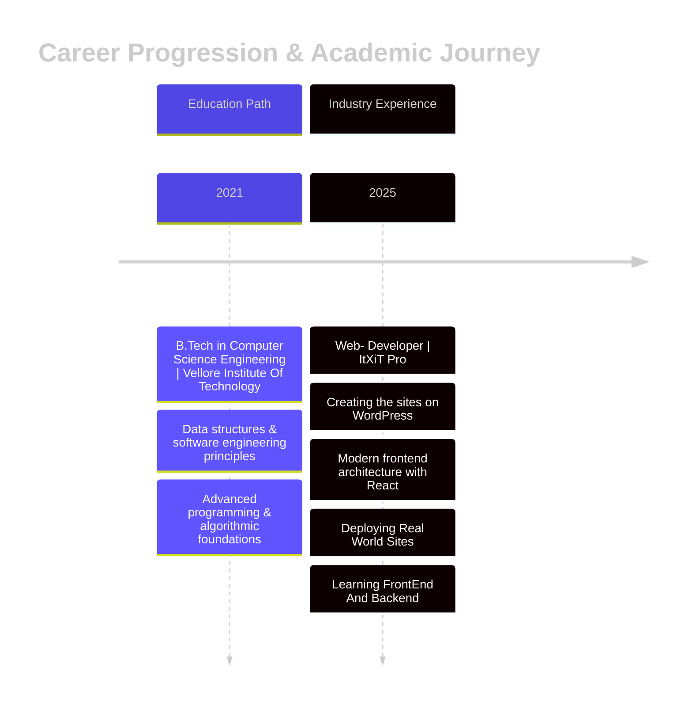

<h1><b>Hi there, I'm </b><a href="https://github.com/Vasudxtt">Vasudutt Pareek</a></h1> &nbsp;***About me***  I am a **Computer Science** student, currently at the last ride of my degree, I am expanding my knowledge in both back-end and front-end development. I have experience as a web developer for the SEO industry, and my goal is to strengthen my development skills and explore new technologies. I love to learn and build something new, creative and funny. - 📚 I’m currently learning ...   - *React*   - *Threejs* - 🚀 I’m eager to join new projects. - ✔ Feel free to ask me anything! I’m motivated to help others. - Outside tech, I enjoy socializing with friends, 🎮 playing video games, 🎵 listening to music, and I also love ⚽ playing football. - 📫 Reach out to me at: <a href="mailto:vasuduttpareek@gmail.com">📧</a>

<h1> 🤝🏻 Connect with Me </h1>

&nbsp;   
&nbsp;   
&nbsp; 
&nbsp; 

# 💻 Tech Arsenal:
<b>
 Front end: 
  
  
</b>
  
<table>
  <tr>
    <td align="center"  width="96">
        
       Html
    </td>
    <td align="center" width="96">
        
       Css
    </td>
    <td align="center" width="96">
        
      Javascript
    </td>
    <td align="center"  width="96">
        
       React
    </td>
    <td align="center"  width="96">
        
       Next
    </td>
    <td align="center"  width="96">
        
       Vite
    </td>
    <td align="center"  width="96">
        
       TailWind
    </td>
  </tr>
</table>

<b>
 Back end: 
</b>

<table>
  <tr>
    <td align="center"  width="96">
        
       Laravel
    </td>
    <td align="center" width="96">
        
       PHP
    </td>
    <td align="center" width="96">
     
       Java
    </td>
    <td align="center" width="96">
        
       Sql
    </td>
    <td align="center" width="96">
        
      Javascript
    </td>
    <td align="center" width="96">
        
      Express
    </td>
    <td align="center" width="96">
        
      Node
    </td>
  </tr>
</table>

<b>
 Databases </b></b>

<table>
  <tr>
    <td align="center" width="96">
     
       Mysql
    </td>
    <td align="center" width="96">
     
       MongoDB
    </td>
    <td align="center" width="96">
     
       PostGre
    </td>
    
  </tr>
</table>

<b>
 Programming Languages: 
</b>

<table>
  <tr>
    <td align="center" width="96">
     
       Java
    </td>
    <td align="center" width="96">
        
       Python
    </td>
 </tr>
</table>

<b>
 Tools: 
</b>

<table>
  <tr>
    <td align="center" width="96"> 
        
       Git
    </td>
    <td align="center" width="96">
        
       Github
    </td>
     <td align="center" width="96">
        
       NPM
    </td>
    <td align="center" width="96">
        
       WordPress
    </td>
     <td align="center" width="96">
        
       Window Terminal
    </td>
    
 </tr>
</table>

  

<h1>🎓💼Professional Journey</h1>

# 📊 GitHub Stats:
 
 

# 🎮TimePass : 

### ✍️ Random Dev Quote

<!-- visiter Count-->

<!--     
    
     -->
  

 
 

<table>
  <tr>
    <td>
      
    </td>
    <td>
      
<b>Feel Good Inc. Gorillaz,De La Soul</b>

       
      

      <button>⏪</button>  
      <button>⏸</button>  
      <button>⏩</button>
      

    </td>
  </tr>
  <tr>
    <td colspan="2" align="center">
      <button>⏪</button>  
      <button>⏸</button>  
      <button>⏩</button>
    </td>
  </tr>
</table>

